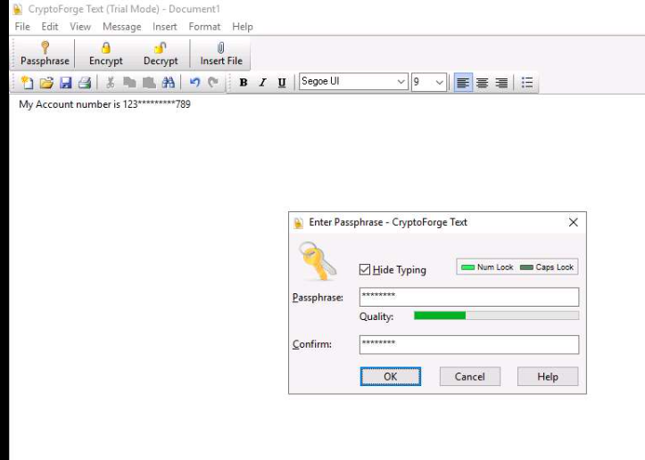
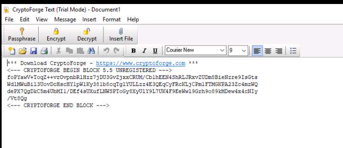

# Cryptography

## **Calculate One-way Hashes using HashCalc**

HashCalc tool

## **Calculate MD5 Hashes using MD5 Calculator**

**MD5 Calculator tool**

## **Calculate MD5 Hashes using HashMyFiles**

**HashMyFiles tool**

## **Perform File and Text Message Encryption using CryptoForge**

**CryptoForge after installation of this tool** 

### To Encrypt

Right-click the **Confidential.txt** file and click **Show more options** and select **Encrypt** from the context menu.

The **Enter Passphrase - CryptoForge Files** dialog-box appears; type a password in the **Passphrase** field, retype it in the **Confirm** field, and click **OK**.

### To Decrypt

Double-click the encrypted file to decrypt it and view its contents

The **Enter Passphrase - CryptoForge Files** dialog-box appears; enter the password that you have provided in above step to encrypt the file and click **OK**

encrypted file is shown as **Secret Message.cfd**.
 

plaintext

Cipertext

## **Encrypt and Decrypt Data using BCTextEncoder**

**BCTextEncoder.exe tool**

## Other cryptography tools

**AxCrypt** (https://www.axcrypt.net)

**Microsoft Cryptography Tools** (https://docs.microsoft.com)

**Concealer** (https://www.belightsoft.com) 

## Hash identifier and Hash cracking

### Hash Identifier

[https://www.onlinehashcrack.com/hash-identification.php](https://www.onlinehashcrack.com/hash-identification.php)

### Hash Crack

[https://crackstation.net/](https://crackstation.net/)[https://hashes.com/en/decrypt/hash](https://hashes.com/en/decrypt/hash)

### Hashcat

Hashcat -a 3 -m 900 hash.txt /rockyou.txt

- a attack mode
-m hashtype
900 md4
1000 NTLM
1800 SHA512CRYPT
110 SHA1 with SALT HASH
0 MD5
100 SHA1
1400 SHA256
3200 BCRYPT
160 HMAC-SHA1

### John

1. First analyze hash type - `john hashfile.hash`
2. Then crack hash - `john hashfile.hash --wordlist=/usr/share/wordlists/rockyou.txt --format=Raw-SHA1`
3. Show the cracked password - `john --show --format=Raw-SHA1 hashfile.hash` OR `john --show hashfile.hash