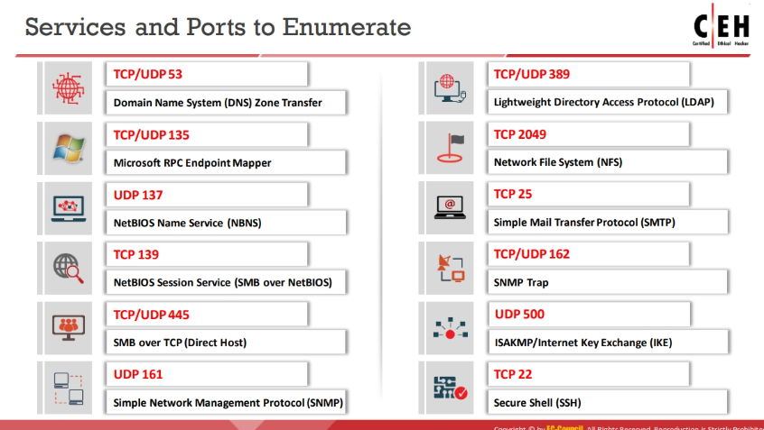

# Enumeration

[NetBIOS Enumeration](Enumeration/NetBIOS%20Enumeration.md)

[SNMP Enumeration](Enumeration/SNMP%20Enumeration.md)

[LDAP Enumeration ](Enumeration/LDAP%20Enumeration.md)

[NTP and NFS Enumeration](Enumeration/NTP%20and%20NFS%20Enumeration.md)

[SMTP Enumeration](Enumeration/SMTP%20Enumeration.md)

[DNS Enumeration](Enumeration/DNS%20Enumeration.md)

[IPSec Enumeration](Enumeration/IPSec%20Enumeration.md)

with 137 there is also 138 used

with 389 there is also 88 used and for SLDAP there is 636 used